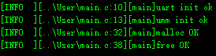

# UMM_MALLOC在STM32上的移植

> 运行结果（串口助手显示）



本项目基于 **rhempel **大神的开源仓库 **umm_malloc** ，仓库地址为[https://github.com/rhempel/umm_malloc](https://github.com/rhempel/umm_malloc),程序移植性强，鲁棒性好。**经过本人在PC和STM32均验证，可放心使用**。

## 环境和依赖

- 32位MCU和对应工具链（比如STM32和Keil）
- 开源大神源码

## 详细步骤

1. 下载源码

2. 找一个可以完全编译的工程

3. 把下载源码里面的src目录放入你的工程，目录名字改为umm_malloc（个人习惯）

4. 添加目录里面的所有c文件，并把路径加入项目

5. 创建**umm_malloc_cfgport.c**和**umm_malloc_cfgport.h**文件

6. 在**umm_malloc_cfgport.h**文件中定义**UMM_MALLOC_CFG_HEAP_ADDR**的变量名指向buffer的指针变量地址、定义**UMM_MALLOC_CFG_HEAP_SIZE**大小（单位字节）。参考如下：

   ```c
   #ifndef __UMM_CFGPORT_H
   #define __UMM_CFGPORT_H
   
   #define UMM_MALLOC_CFG_HEAP_ADDR heap_addr
   
   #define UMM_MALLOC_CFG_HEAP_SIZE heap_size
   
   #endif //__UMM_CFGPORT_H
   ```

7. 在**umm_malloc_cfgport.c**中添加变量并和头文件对应上

   ```c
   #include "umm_malloc_cfgport.h"
   #include <stdint.h>
   
   //@config<array>
   //堆空间大小分配
   uint8_t heap_buff[1024*4] = {0};
   void * heap_addr = (void *)heap_buff;
   uint32_t heap_size = sizeof(heap_buff);
   ```

8. 随后在初始化的地方包含头文件**umm_malloc.h**并调用

   ```c
   umm_init();
   ```

9. 现在你可以正常使用这些函数了

   ```c
   void *umm_malloc(size_t size);
   void *umm_calloc(size_t num, size_t size);
   void *umm_realloc(void *ptr, size_t size);
   void  umm_free(void *ptr);
   ```

## 测试

测试没有什么大碍，比KEIL给的标准库malloc/free好太多了。

## 注意

- 堆大小单位为字节
- 堆消耗 = 16字节固定开销 + 用户累计申请字节数 + 8*用户申请次数 + 内存碎片(可能有)
- 实际项目应该有20%~30%的余量
- 分配的堆空间应该远大于8且是4的整数倍
- 内存申请完记得在不用时释放


作者：阳海峰 

BILIBILI昵称：風吹海浪 

邮箱：yang_hfff@qq.com 

致谢遇见的人...
